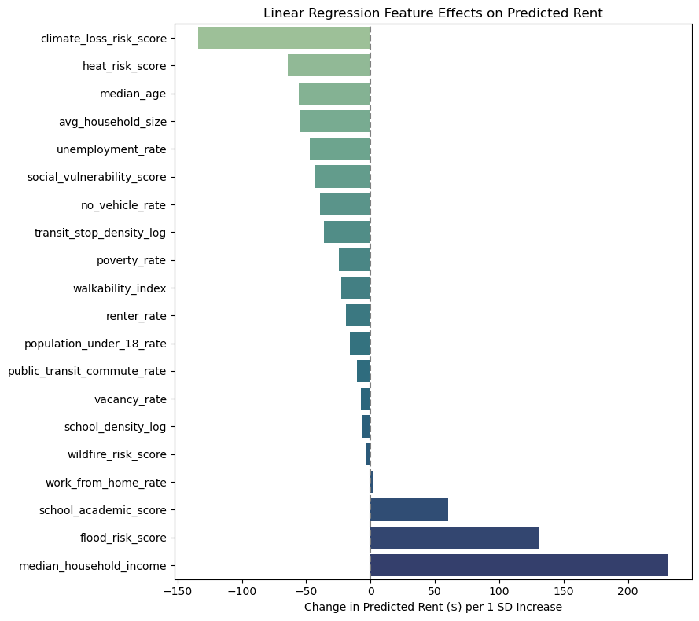
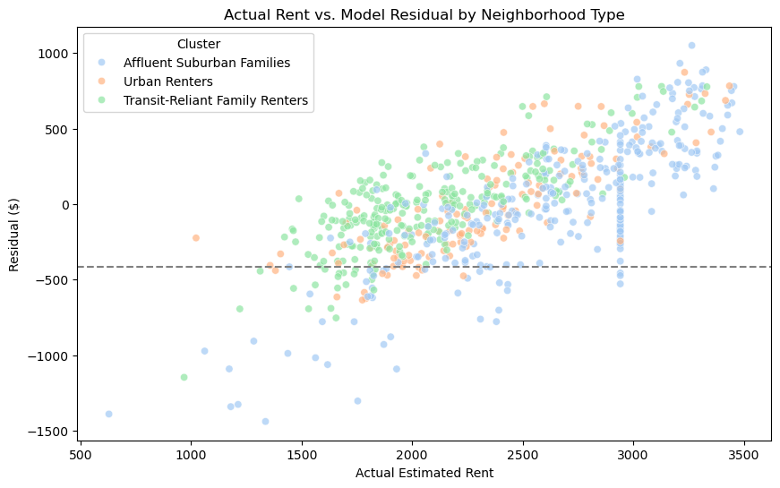
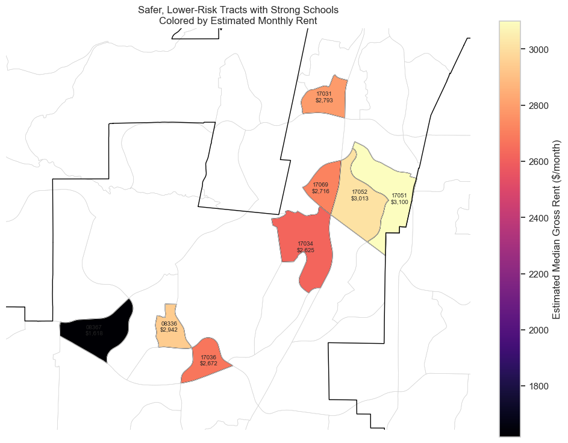

# San Diego Development Opportunity Finder

## Overview

This project analyzes 727 census tracts across San Diego County to compare neighborhood conditions related to housing, transportation, walkability, schools, climate risk, demographics, and limited safety data.

The project started as an attempt to create one overall “development opportunity score,” but that became too broad. Instead, I built a first-pass screening tool using regression and clustering.

The regression model estimates expected rent based on tract conditions, then compares predicted rent with actual estimated rent. Tracts with much lower actual rent than predicted are flagged as places worth looking into more closely.

K-Means clustering is also used to group tracts into broader neighborhood types so similar areas are easier to compare.

## Data Sources

Main public data sources include:

- U.S. Census / ACS demographic and housing data
- City of San Diego police and transit data
- EPA walkability data
- FEMA National Risk Index data
- California public school, school district, and academic performance data

The final modeling dataset contains 727 tracts and 20 numeric features.

## Reproducing the Project

Raw source files are not stored in this repository. The data can be downloaded from the public sources listed above and placed in the appropriate local data folders before running the notebooks.

Run the notebooks in numerical order from `00_data_wrangling_census.ipynb` through `10_modeling.ipynb`.

## Requirements

This project uses Python and Jupyter Notebook. Main packages include:

- pandas
- numpy
- geopandas
- scikit-learn
- matplotlib
- seaborn
- joblib

Install the required Python packages with:

```bash
pip install -r requirements.txt
```

## Project Files

- [Final Project Report](documentation/Capstone%203%20Final%20Report.pdf)
- [Model Metrics](documentation/Model%20Metrics.txt)
- [EDA Notebook](notebooks/08_eda.ipynb)
- [Preprocessing Notebook](notebooks/09_preprocessing.ipynb)
- [Modeling Notebook](notebooks/10_modeling.ipynb)
- [Final Presentation](documentation/Final%20Presentation.pdf)

## Project Structure

```text
san-diego-development-opportunity-finder/
├── data/
│   ├── raw/              # original source files
│   └── processed/        # cleaned and modeling-ready outputs
├── documentation/        # report and presentation visuals
│    ├── Capstone 3 Final Report
│    ├──  Capstone 3 Final Presentation
│    └── model_metrics.txt     
├── notebooks/            # wrangling, EDA, preprocessing, and modeling      
├── README.md

```
## Notebook Order

1. `00_data_wrangling_census.ipynb` : cleans ACS demographic and housing data
2. `01_data_wrangling_crime.ipynb` : cleans crime data and creates tract-level safety features
3. `02_data_wrangling_walkability.ipynb` : prepares EPA walkability data
4. `03_data_wrangling_transit.ipynb` : creates tract-level transit features
5. `04_data_wrangling_climate.ipynb` : prepares FEMA climate and risk features
6. `05_data_wrangling_schools.ipynb` : creates school and district-level features
7. `06_data_wrangling_final_merge_0.ipynb` : combines the cleaned source datasets
8. `07_data_wrangling_final_merge_1.ipynb` : handles final merge fixes and missing data
9. `08_eda.ipynb` : explores feature relationships and tract patterns
10. `09_preprocessing.ipynb` : prepares the 20 modeling features and train/test split
11. `10_modeling.ipynb` : compares regression models, runs clustering, and creates residual screening outputs


## Modeling

I tested two regression models:

- Linear Regression
- Random Forest Regressor

The Random Forest was tuned using GridSearchCV, but Linear Regression performed slightly better on the test set and was easier to interpret.

Final Linear Regression results:

Test R²: 0.566
RMSE: about $364
MAE: about $278



I then used the final model to estimate rent across all 727 tracts. The bottom 10% of residuals, about -$415 or lower, flagged 73 tracts where actual rent was much lower than expected.

## Neighborhood Clusters

I also tested K-Means clustering and selected 3 clusters:

- Affluent Suburban Families
- Transit Family Renters
- Urban Renters

The silhouette scores were low, so these are broad neighborhood types rather than strict categories.



## How I'd Use It

This project is meant to narrow down a large set of tracts before doing more detailed research.

For example, I can filter for stronger safety scores, lower climate-loss risk, school quality, rent level, or neighborhood type, then map the remaining tracts to see where they are located and whether any geographic patterns stand out.



## Limitations

This is not a development success or property valuation model. It doesn't include parcel-level zoning, land cost, construction costs, permitting, unit condition, leasing data, or full countywide crime coverage. Safety data is only reliable within SDPD jurisdiction.

The regression model explains a little over half of the variation in rent, so the results should be treated as screening signals rather than exact predictions.

## Future Improvements

Future versions could include zoning data, permits, housing age, better school assignment data, and more detailed SANDAG GIS sources.

I'd also want to test different target variables and remove income from some models to better understand how the other neighborhood features relate to each other.

